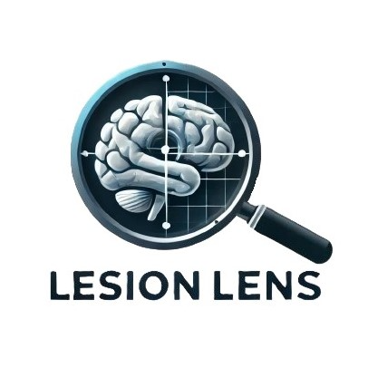

  

    
  

  <h1 align="center"><a href="https://scorpia2004.github.io/LesionLensWeb/">LesionLens</a></h1>

<!--
## How to run:
<i>CTRL + left click on links</i>
1. Run the [web service](https://campus-connect-undefined-api.onrender.com/) in a new tab: 
2. Wait for the webpage to display "ok!"
3. Then open the Campus Connect website in another new tab: [CampusConnect](https://campus-connect-undefined.onrender.com/)
-->

[![](https://mermaid.ink/img/pako:eNp9VW1PIjEQ_itN7ysQQBDYD5ecbvRyyh0B9RKLH-ru7G7j0u61XRWN__2mLQgI2k0KnXlm-sxL21eaqBRoRJvN5lxaYUuIyESrXPMFyUr1NJeJkpnIo7kkxBawQP09N_C-vOFa8PsSjEcQVCYPuVa1TCMyp9-yrI1jToOy0mLB9fJUlUp7dQfct1ZbeLYbXebHB9OrLyAGkGu643-QuW8NyJQ8aOyDn0sXb1JwbcnlNBis_Nb3mI-qcIlJmZvqxAol74L6hM2ghMSSCbcCpF2LSbP5nZyyGwFPpBDGKr3cUcXsuioVT4lEwHi60sVeN7NchvWFX_9WIuTccdpjBUgKmpVWCRgjZL5y5Y1W5noRZM6xF12wE8ENSZTWsI4mQHacO0vmJl4Kw7eidmPMbskMPQCRnyBApp-4RWosENSwm083frFYmESDBfKXP2J6LbGaS5PhPtsw0mxhLDfsnNcYOYZ2JkoLepODr0i4XDA3Yc-k4uUj9zM2BSNedn2dhR3PnU6VtTMhmXgGs4U5D5if7FRJg4XHniAmQXI5r8xhXlt_XbJ9hSbv9TxQ8rWKTfaq7o3_sBiTl1hD8GgiSUNqhyFjPO7lCvnHAW-xe_MFUtwOf4vOxn9ozApxvNxnpIxlbiJ7hA5lPnhhq19sgbwu8SLZq8HU5TAVToqwKZZKLbDGUKbbiZwGamy2UMoWjuoVJIUU_2rYy_d6sfm3JuFzzn6kqSEpt5xYRapwov3xvdsymXiwLTRAfLC1goodxeRRmPrQyXDjygE0VERl5DKU6SPCb3TNSiEfsIQVeRK2IN3Y99PB2HabijboAvBoihTv-FcnnlN_bc-puwOx8R_cBfiGOF5bNVvKhEZW19CgdYVZgFhw9xbQKOOlQWnFJY1e6TONOqNBq99td4ajzhC_9nG_QZc06vZbve6o2-sM-sPe8HjUGbw16ItS6KLTard7o_YRSnud7qjdGzQoYHGVHodHyL9Ffo9bbxCI4GOSFysCb_8BIccWBQ?type=png)](https://mermaid.live/edit#pako:eNp9VW1PIjEQ_itN7ysQQBDYD5ecbvRyyh0B9RKLH-ru7G7j0u61XRWN__2mLQgI2k0KnXlm-sxL21eaqBRoRJvN5lxaYUuIyESrXPMFyUr1NJeJkpnIo7kkxBawQP09N_C-vOFa8PsSjEcQVCYPuVa1TCMyp9-yrI1jToOy0mLB9fJUlUp7dQfct1ZbeLYbXebHB9OrLyAGkGu643-QuW8NyJQ8aOyDn0sXb1JwbcnlNBis_Nb3mI-qcIlJmZvqxAol74L6hM2ghMSSCbcCpF2LSbP5nZyyGwFPpBDGKr3cUcXsuioVT4lEwHi60sVeN7NchvWFX_9WIuTccdpjBUgKmpVWCRgjZL5y5Y1W5noRZM6xF12wE8ENSZTWsI4mQHacO0vmJl4Kw7eidmPMbskMPQCRnyBApp-4RWosENSwm083frFYmESDBfKXP2J6LbGaS5PhPtsw0mxhLDfsnNcYOYZ2JkoLepODr0i4XDA3Yc-k4uUj9zM2BSNedn2dhR3PnU6VtTMhmXgGs4U5D5if7FRJg4XHniAmQXI5r8xhXlt_XbJ9hSbv9TxQ8rWKTfaq7o3_sBiTl1hD8GgiSUNqhyFjPO7lCvnHAW-xe_MFUtwOf4vOxn9ozApxvNxnpIxlbiJ7hA5lPnhhq19sgbwu8SLZq8HU5TAVToqwKZZKLbDGUKbbiZwGamy2UMoWjuoVJIUU_2rYy_d6sfm3JuFzzn6kqSEpt5xYRapwov3xvdsymXiwLTRAfLC1goodxeRRmPrQyXDjygE0VERl5DKU6SPCb3TNSiEfsIQVeRK2IN3Y99PB2HabijboAvBoihTv-FcnnlN_bc-puwOx8R_cBfiGOF5bNVvKhEZW19CgdYVZgFhw9xbQKOOlQWnFJY1e6TONOqNBq99td4ajzhC_9nG_QZc06vZbve6o2-sM-sPe8HjUGbw16ItS6KLTard7o_YRSnud7qjdGzQoYHGVHodHyL9Ffo9bbxCI4GOSFysCb_8BIccWBQ)

## 🌟 Motivation

Doctors are overworked. Our software automatically analyzes MR images of the spine and brain to detect, count, and track (over time) lesions, 
saving doctors time, reducing workload, and improving diagnosis accuracy. The analysis is presented as an interactive 3D model, 
accessible directly on our web app, enabling faster and more accurate decision-making from anywhere.

## 🎯 Goals

Our foremost goal is to reduce the time a doctor needs to spend examining a patient's MRI to find and analyse MS lesions. Additionally, we aim to streamline essential processes such as identification, progress tracking, etc. Also, mastering these tasks can take a doctor years of practice. By automating these activities, we plan enhance the doctor's efficiency and accuracy.

## 💡 Problem to Be Solved

As we observed first-hand, doctors are usually under immense pressure while performing the delicate tasks of examining patients. This tool will release some of the burden as it will automate some parts of the diagnosis process thus enabling the doctor to make better diagnosis faster and with more confidence.

## ✨ Selling Points

TODO

## 🌟 Interesting Factor

TODO

## 🚀 Features

TODO

### 📊 [Track our progress here](https://wirehaired-chess-bd5.notion.site/LesionLens-Final-Year-Project-2063c963e82e46d2a243154cef256844?pvs=74)

## 👥 Team members:

<table align="center">
  <tbody>
    <tr>
      <td align="center" valign="top" width="20%"><a href="https://github.com/berkOzkanCSGod"> <b>Berk Özkan</b></a> 22001293</td>
      <td align="center" valign="top" width="20%"><a href="https://github.com/SCORPIA2004"> <b>Muhammad Shayan Usman</b></a> 22101343</td>
      <td align="center" valign="top" width="20%"><a href="https://github.com/mertfidan715"> <b>Mert Fidan</b></a> 22101734</td>
            <td align="center" valign="top" width="20%"><a href="https://github.com/ardaBaktir"> <b>Arda Baktir</b></a> 21802354</td>
      <td align="center" valign="top" width="20%"><a href="https://github.com/hkeremh"> <b>Emir Kerem Şahin</b></a> 22101882</td>

  </tbody>
</table>

# LesionLens
Parent repo for the LesionLens project

## Links
- [Project Website](https://scorpia2004.github.io/LesionLensWeb/)

- [API](https://github.com/berkOzkanCSGod/lesionlens-api)

- [ML](https://github.com/berkOzkanCSGod/lesionlens-ml)
